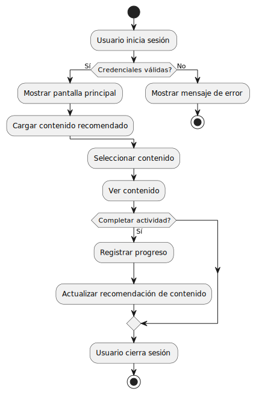
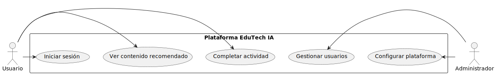
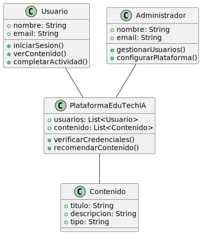
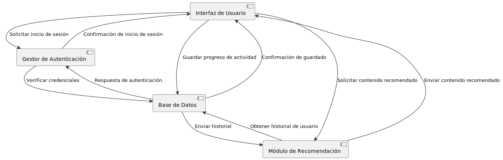
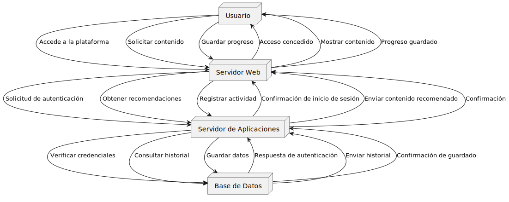
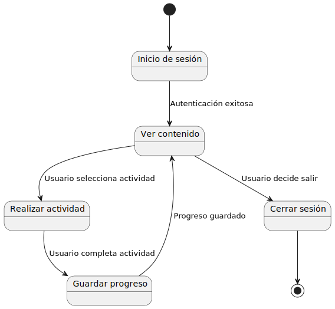
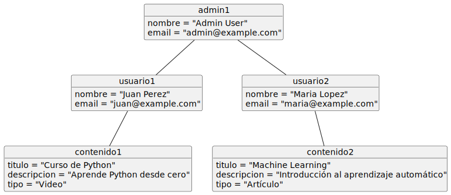
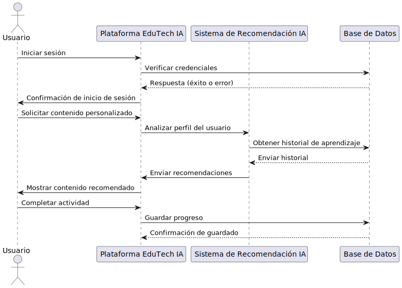
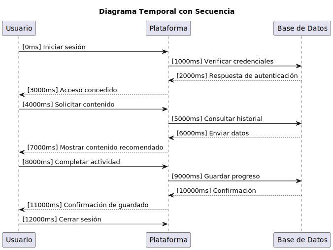

# EduTech IA

## Link al repositorio 

https://github.com/dxn1l/EduTechIA

## Descripción

EduTechIA es una startup enfocada en revolucionar la educación mediante el uso de inteligencia artificial. 

Este repositorio contiene el desarrollo del MVP (Producto Mínimo Viable), que tiene como objetivo demostrar la viabilidad técnica y la eficiencia operativa del sistema.

## Estructura del Proyecto

### Tecnologías Utilizadas

- **Lenguaje y Paradigma:** Java con Programación Reactiva.
- **Arquitectura del Software:** Basada en microservicios con módulos como:
  - Frontend
  - Backend
  - Base de Datos
  - API Gateway
  - Sistema de Recomendaciones
- **Entorno de Desarrollo:** Visual Studio Code, Git y GitHub para control de versiones.
- **Pipeline CI/CD:** Implementado con GitHub Actions y Docker.
- **Seguridad:** Protocolos de autenticación en dos pasos, cifrado de datos y revisión de código.
- **Gestión de Entornos:** Desarrollo, Preproducción y Producción.

## Documentación Técnica

### Archivos PDF

1. **Lenguaje y Paradigma:** Explica la elección de Java y la programación reactiva para el desarrollo del MVP.
2. **Arquitectura del Software:** Describe la estructura modular del sistema y su interacción.
3. **Entorno de Desarrollo y Herramientas:** Presenta las herramientas utilizadas como VS Code y GitHub.
4. **Entrega Continua y Pipeline CI/CD:** Detalla el flujo de trabajo automatizado para integración y despliegue.
5. **Protocolo de Seguridad del Desarrollo:** Enumera las prácticas de seguridad adoptadas en el proyecto.
6. **Estrategia y Optimización del Entorno:** Define la gestión de entornos y estrategias de escalabilidad.
7. **Informe Final Integrado:** Resume los procesos, aprendizajes y decisiones tomadas en el desarrollo del proyecto.

## Diagramas UML

- **Diagrama de Actividades:** Representa el flujo de tareas dentro del sistema.

- **Diagrama de Casos de Uso:** Muestra las interacciones entre los usuarios y la plataforma.

- **Diagrama de Clases:** Define la estructura del código basado en objetos.

- **Diagrama de Componentes:** Explica la organización de los módulos del sistema.

- **Diagrama de Despliegue:** Ilustra la distribución de los servidores y entornos.

- **Diagrama de Estado:** Representa los cambios en los objetos del sistema.

- **Diagrama de Objetos:** Visualiza la relación entre instancias en tiempo de ejecución.

- **Diagrama de Secuencia:** Explica el flujo de llamadas entre componentes.

- **Diagrama Temporal:** Muestra la evolución del sistema con el tiempo.

